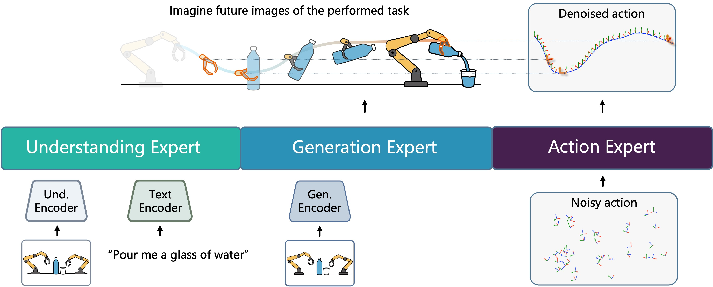

<div align="center">

# InternVLA-A1: Unifying Understanding, Generation, and Action for Robotic Manipulation​

</div>

---

InternVLA-A1 is an end-to-end vision–language–action (VLA) framework unifing understanding, generation ,and action for robotic manipulation. It leverages predictive imagination of task evolution to guide execution, enabling enhanced manipulation in highly dynamic environments. 

## :fire: Highlights <a name="high"></a>


- **Novel Model Archituecture**: A Mixture-of-Transformers architecture for unified understanding, generation, and action.
- **Hybrid Synthetic-Real Data Corpus**: A hybrid synthetic-real manipulation dataset [InternData-A1](https://huggingface.co/datasets/InternRobotics/InternData-A1), integrating 5 heterogeneous robots, 15 skills, and 200+ scenes, emphasizing multi-robot collaboration under dynamic scenarios.
- **Impressive Real-World performance**: InternVLA-A1 demonstrates strong effectiveness and generalization in highly dynamic scenarios involving dynamic grasping of conveyor belts and multi-robot collaboration.

### 🏆 **Unified Understanding-Generation-Action Family**

- **F1-VLA** (F1 is a prequel version of InternVLA-A1): [Paper](https://arxiv.org/abs/2509.06951) | [Code](https://github.com/InternRobotics/F1-VLA) | [Model](https://huggingface.co/InternRobotics/F1-VLA)
- **InternVLA-A1**: [Code](https://github.com/InternRobotics/InternVLA-A1) | [Paper/Model (Scheduled for late September release)]()

## 🤖 Real-World Robot Demonstrations

### **Package grabbing and flipping in conveyor belt**
<div align="center">
    <video src="https://github.com/user-attachments/assets/c7d8989c-be14-428e-b498-d02dc1fc1475"
         controls autoplay muted playsinline loop width="720"></video>
  <p><em>The model handles dynamically shaped packages on conveyor belts, tracking and predicting their trajectories in real-time to achieve high-speed stable grasping, while adaptively flipping packages and identifying express information from delivery notes.</em></p>
</div>


### **Multi-robot collaboration on long-horizon tasks in dynamic environments**
<div align="center">
      <video src="https://github.com/user-attachments/assets/c438ff8a-4536-45b3-9117-e210c36ba8a0"
         controls autoplay muted playsinline loop width="720"></video>
  <p><em>The model swiftly identifies, locates, and grips high-speed ingredients based on task demands, showcasing its adaptability in complex environments.</em></p>
</div>


## 🚀 Quick Start

### **Prerequisites**
- Python ≥ 3.10
- torch ≥ 2.6.0
- CUDA ≥ 12.4

### **Installation**
```bash
# Clone repository
git clone https://github.com/InternRobotics/InternVLA-A1.git

# Create environment
conda create -f internvla_a1 python==3.10
conda activate internvla_a1

# Install dependencies
pip install torch==2.6.0 torchvision==0.21.0 torchaudio==2.6.0 torchcodec==0.2.1 --index-url https://download.pytorch.org/whl/cu124

# install other requirements
pip install -r requirements.txt

pip install numpy==1.26.4
```

## 📄 License

This project is licensed under the MIT License.

## 🙏 Acknowledgments

- [Lerobot](https://github.com/huggingface/lerobot)
- [InternVL](https://github.com/OpenGVLab/InternVL)
- [COSMOS](https://github.com/nvidia-cosmos)
- [Any4lerobot](https://github.com/Tavish9/any4lerobot/)
- [VAR](https://github.com/FoundationVision/VAR)
